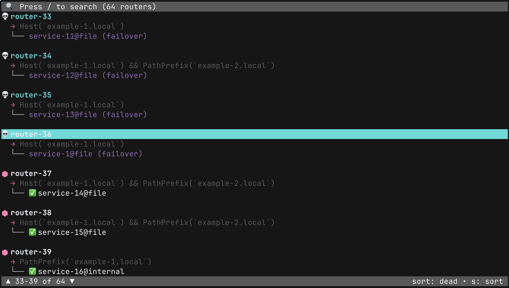

<div>
<picture>
  <source media="(prefers-color-scheme: dark)" srcset="assets/logo-dark.svg">
  <source media="(prefers-color-scheme: light)" srcset="assets/logo-light.svg">
  
</picture>
 
[](https://github.com/darksworm/traefiktop/releases/latest)
[](https://github.com/darksworm/traefiktop/releases/latest)
[](./LICENSE)
[](https://codecov.io/github/darksworm/traefiktop)
</div>

A fast, keyboard‑friendly terminal UI for exploring Traefik routers and services. Rewritten in Rust using Ratatui for improved performance and resource efficiency.

## 🚀 **Major Update: Now Written in Rust!**

**v2.0 Migration**: This version represents a complete rewrite from TypeScript/Node.js to Rust. The CLI interface remains identical, but you'll benefit from:

- **🔥 Faster startup** and lower memory usage
- **⚡ Better performance** for large Traefik deployments  
- **📦 Single binary** - no Node.js runtime required
- **🎯 Same familiar interface** and keyboard shortcuts

> **Migration Note**: The npm package is deprecated as of v2.0. Please use the native binaries instead.

## 🚀 Installation methods

<details>
  <summary><strong>Install Script (Linux/macOS)</strong></summary>

```bash
curl -sSL https://raw.githubusercontent.com/darksworm/traefiktop/main/install.sh | sh
```

The install script automatically detects your system (including musl vs glibc on Linux) and downloads the appropriate binary from the latest release.

You can also install a specific version:
```bash
curl -sSL https://raw.githubusercontent.com/darksworm/traefiktop/main/install.sh | sh -s -- v0.1.0
```
</details>

<details>
  <summary><strong>Docker (Linux/macOS)</strong></summary>

Pull and run the prebuilt image from GHCR:

```bash
docker run --rm -it ghcr.io/darksworm/traefiktop:latest \
  --host https://traefik.example.org
```

For self-signed endpoints, add `--insecure`. To reach a Traefik container, attach to its network:

```bash
docker run --rm -it --network <traefik_net> ghcr.io/darksworm/traefiktop:latest \
  --host http://traefik:8080
```

Build locally instead of pulling:

```bash
bun run docker:build
bun run docker:run -- --host https://traefik.example.org
```

</details>

<details>
  <summary><strong>npm (DEPRECATED as of v2.0)</strong></summary>

> ⚠️ **Deprecated**: The npm package is no longer maintained as of v2.0. Please use the native binaries instead for better performance.

```bash
# Last TypeScript version (v1.x)
npm i --global traefiktop@1
```
</details>

<details>
  <summary><strong>Homebrew (Linux/macOS)</strong></summary>

```bash
brew tap darksworm/homebrew-tap
brew install --cask traefiktop
```
</details>

<details>
  <summary><strong>AUR (Arch User Repository)</strong></summary>

```bash
yay -S traefiktop-bin
```
</details>

<details>
  <summary><strong>Download a binary</strong></summary>

Grab binaries and packages from the latest release:
https://github.com/darksworm/traefiktop/releases/latest

</details>

## Screenshot

<!-- Replace with a real TUI screenshot or GIF -->


## What it shows
- Routers, their rules, and the services they target
- Which router is effectively down (no healthy services)
- The active service path (failover aware)
- Quick, readable status with a minimal set of emojis and colors

## Usage
`--host` is required. Optionally hide routers by name with `--ignore` patterns (case‑insensitive). Use `*` at the start/end for “starts with” / “ends with”. Use `--insecure` to disable TLS verification for development against self‑signed endpoints.

```bash
traefiktop --host https://traefik.example.org \
  --ignore staging-* \
  --ignore *-tmp,*-old
```

Development only (self-signed endpoints):

```
traefiktop --host https://selfsigned.local --insecure
```

## Keys
- Navigation: `j/k` or arrows
- Page: `PgDn/PgUp`, `Ctrl+f/Ctrl+b`
- Jump: `gg` (top), `G` (bottom), `Home/End`
- Search: `/` to filter, `Esc` to clear
- Sort: `s` toggles (dead first/name); `d` dead first; `n` name
- Quit: `q` or `Ctrl+C`

## Build from source
Prereqs: Rust ≥ 1.70

```bash
# Build release binary
cargo build --release

# The binary will be available at target/release/traefiktop
./target/release/traefiktop --help
```

## Docker
- Prebuilt images are published for releases to `ghcr.io/darksworm/traefiktop`.
- Local builds work cross‑platform via a multi‑stage Dockerfile.

Pull and run (interactive TTY):

```bash
docker run --rm -it ghcr.io/darksworm/traefiktop:latest \
  --host https://traefik.example.org
```

Build locally and run:

```bash
# Build multi-arch image
docker buildx build --platform linux/amd64,linux/arm64 -t traefiktop:dev .

# Run (pass CLI flags after image name)
docker run --rm -it traefiktop:dev --host https://traefik.example.org
```

Single-arch build:

```bash
docker build -t traefiktop:dev .
```

## Notes
- API URL is mandatory. The app won’t start without `--host`.
- Ignore patterns support: `foo*` (starts with), `*bar` (ends with), `*mid*` (contains). Pass multiple `--ignore` flags or comma‑separate values.
- When selected, dead routers use a bright red background for better contrast. Active services are colored; inactive/down are grey.
